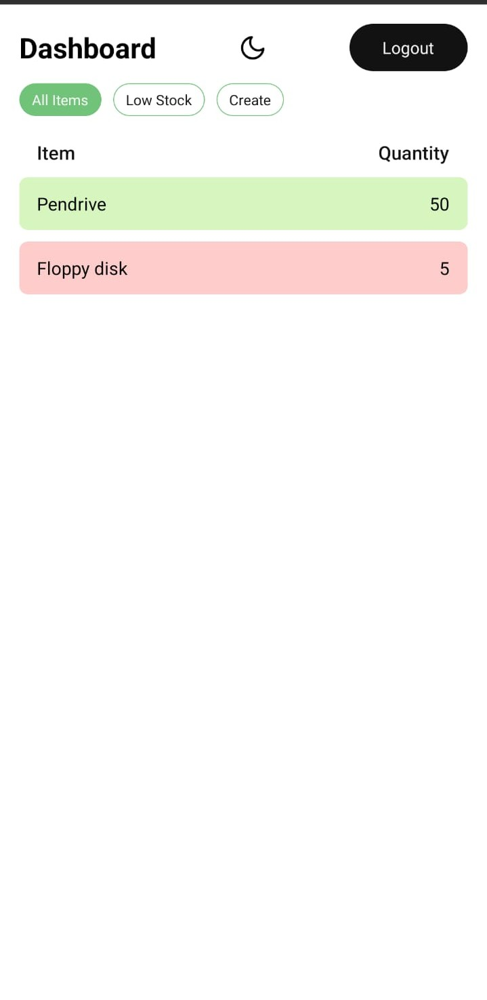
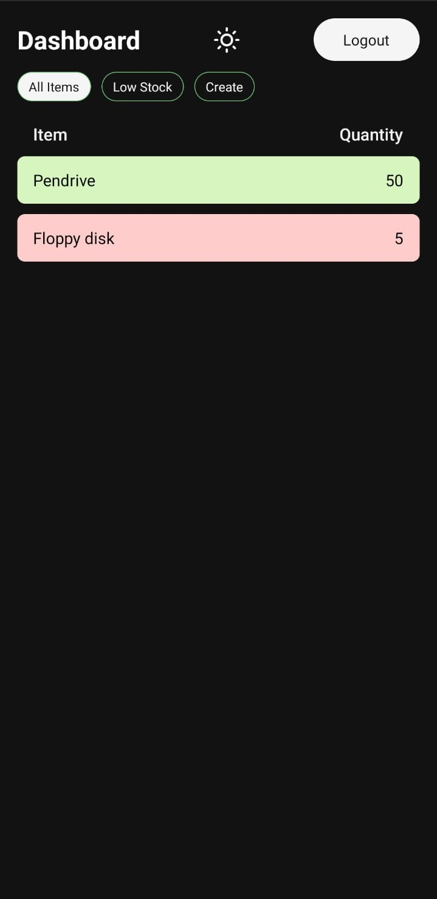
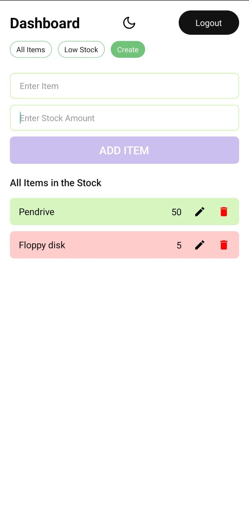
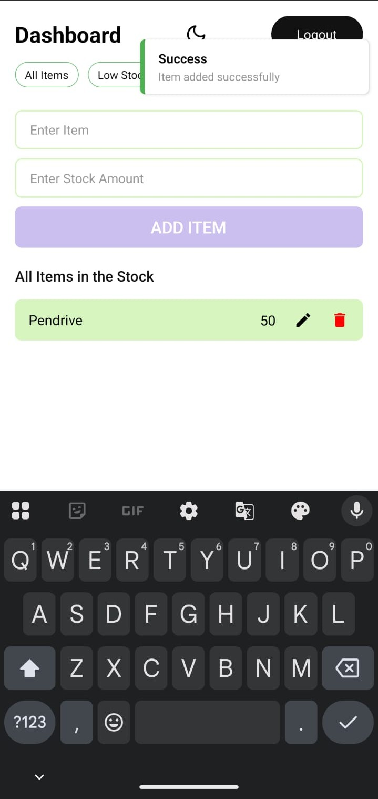
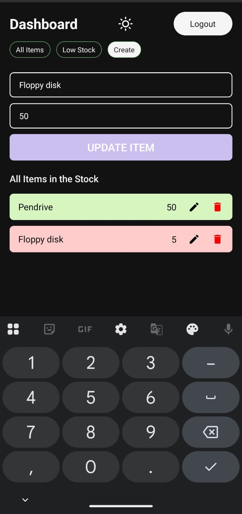
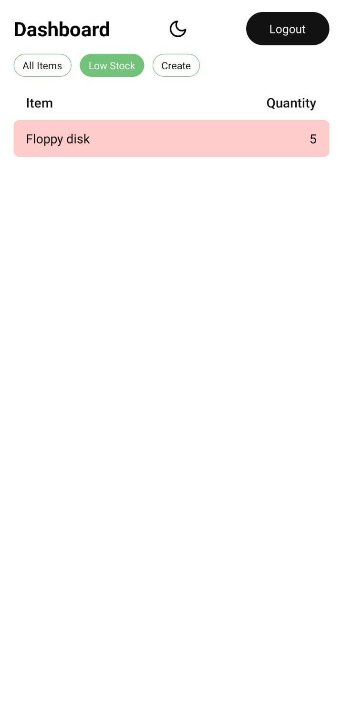
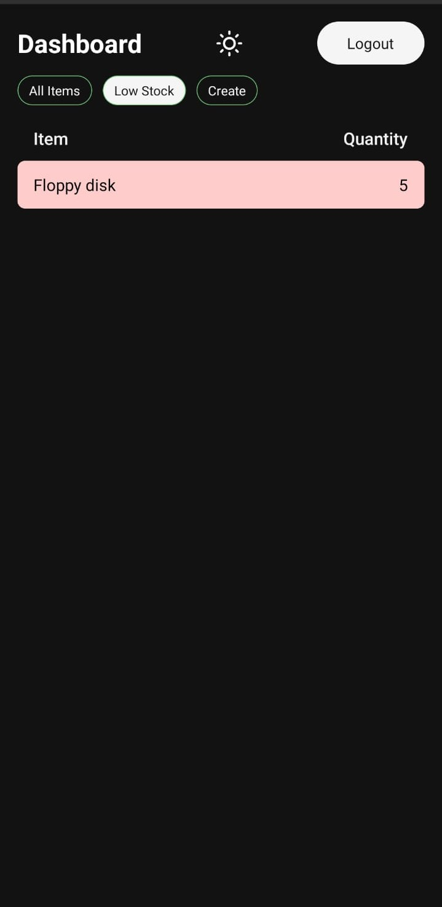
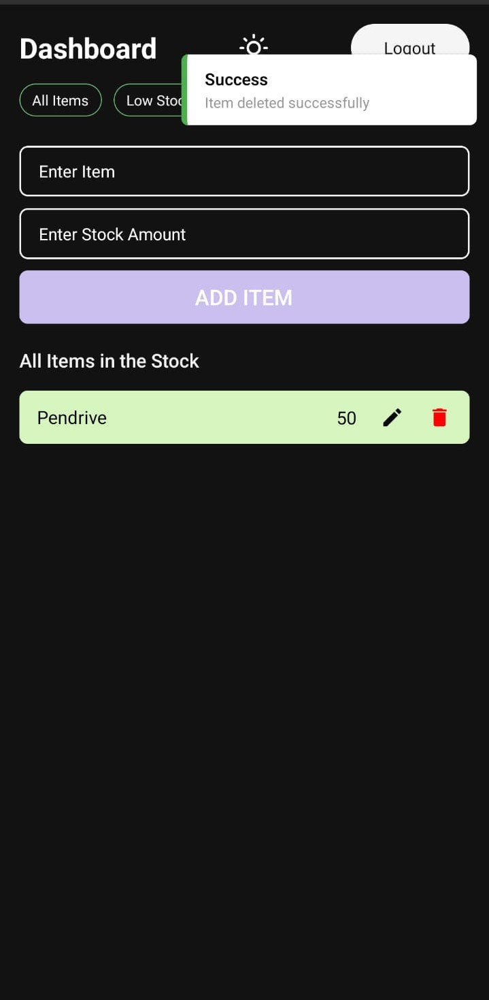

# 📦 InventoX – Inventory Management App (React Native)

InventoX is a **React Native CLI–based inventory management mobile application** designed to help users track, add, update, and manage stock items efficiently with a clean and intuitive UI.

---

## 🚀 Features

- 🔐 Firebase Authentication
  - Email & Password Login
  - Google OAuth Sign-In
- 📊 Inventory Dashboard
- ➕ Add New Items
- ✏️ Update Existing Items
- 🗑️ Delete Items
- ☁️ Cloud Data Storage using Firebase Firestore
- 🔄 Real-time Data Sync
- 🌙 Light & Dark Mode Support
- 📱 Mobile-First UI (Android)

---

## 🛠️ Tech Stack

- **React Native (CLI)**
- **Typescript**
- **Firebase Authentication**
  - Google OAuth
- **Firebase Firestore**
- **React Navigation**
- **Android Emulator / Physical Device**

---

## 🔐 Authentication Flow

- Users can sign up or log in using **Google OAuth**
- Authentication is handled via **Firebase Authentication**
- User session is securely maintained
- Inventory data is scoped per authenticated user

---

## 📸 App Screenshots

### Splash Screen
<p float="left">
  
</p>

### Authentication
<p float="left">
  
  
</p>

### Dashboard
<p float="left">
  
  
</p>

### Add & Update Items
<p float="left">
  
  
  
</p>

### Low Stock and Delete Item
<p float="left">
  
  
  
</p>
---

## ⚙️ Installation & Setup

### Prerequisites
- Node.js
- Android Studio
- React Native CLI

### Steps

```bash
git clone https://github.com/your-username/inventox.git
cd inventox
npm install
npx react-native run-android
